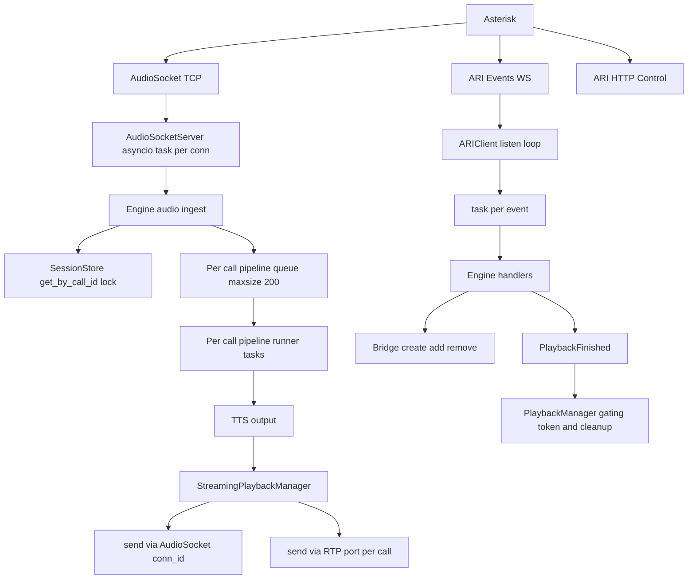

# Análisis técnico del repositorio AI Voice Agent (ai-agent)

> Enfoque del análisis: **AudioSocket TCP como transporte primario**, **control de llamada con ARI/Stasis**, y objetivo de operación estable con **15–20 llamadas concurrentes por instancia** usando **hybrid pipeline** (no full-agent providers).

---

## 0. Resumen ejecutivo (conclusión rápida)

**Sí, el diseño soporta múltiples conexiones concurrentes** a nivel de servidor AudioSocket y a nivel de sesión (call_id) en el Engine, porque está basado en **`asyncio`** y maneja el audio/ciclo por conexión en **tareas por conexión** (no bloquea globalmente por diseño).

Sin embargo, para sostener 15–20 llamadas de forma fiable, hay **riesgos reales de degradación** por:
- **I/O síncrono** en el event loop para playback por archivos (dos implementaciones distintas lo hacen).
- **Contención por lock global** en el SessionStore: cada frame consulta sesión bajo un único `asyncio.Lock`.
- **CPU-heavy en el event loop** (audioop, resampling, DC correction, normalización y logging).
- **Modelo “task-per-event”** en el listener ARI sin backpressure.

**Control de llamada**: El repo **sí implementa** hangup/transfer (blind y warm), bridging humano↔caller, playback y respuesta a eventos (PlaybackFinished, StasisStart/End). **DTMF está capturado pero no es accionable** (principalmente logging).

---

## 1. Capacidad de manejo de múltiples conexiones

### 1.1 ¿Permite varias conexiones simultáneas desde Asterisk sin bloquear?

**AudioSocket server** actúa como servidor TCP concurrente:
- Arranca con [`python.asyncio.start_server()`](src/audio/audiosocket_server.py:80).
- Cada conexión crea una tarea independiente [`python.asyncio.create_task()`](src/audio/audiosocket_server.py:146) que corre un loop propio [`python.AudioSocketServer._connection_loop()`](src/audio/audiosocket_server.py:160).

**Implicación:** una conexión lenta/bloqueada no “bloquea” la aceptación de nuevas conexiones; lo que puede ocurrir es congestión de CPU/event loop si el procesamiento por frame es pesado (ver sección 4).

### 1.2 Modelo de concurrencia usado

**Modelo dominante:** `asyncio` (event loop) + `async/await` + tareas por conexión/call.

- AudioSocket: loop asíncrono por conexión usando [`python.StreamReader.readexactly()`](src/audio/audiosocket_server.py:169).
- ARI: WebSocket loop asíncrono con `async for` + spawn de tareas por evento [`python.asyncio.create_task()`](src/ari_client.py:169).
- Engine: múltiples “workers”/tareas por llamada y colas por llamada (pipeline/streaming).

**No se observa** un diseño basado en “thread por conexión” como arquitectura principal; hay llamadas puntuales a `asyncio.to_thread` en algunos lugares del repo (no relevantes aquí para AudioSocket accept). El grueso es single-event-loop.

### 1.2.1 Cuellos de botella evidentes

1) **Lock global del SessionStore**  
Todas las operaciones de sesión usan el mismo [`python.asyncio.Lock()`](src/core/session_store.py:37). Lecturas en caliente:
- [`python.SessionStore.get_by_call_id()`](src/core/session_store.py:67) adquiere lock.
- El Engine consulta sesión por cada frame de AudioSocket en [`python.Engine._audiosocket_handle_audio()`](src/engine.py:2483).

Con 15–20 llamadas y frames típicos de 20 ms, esto puede introducir contención (no deadlock, pero sí latencia/jitter).

2) **I/O síncrono**  
Playback por archivos escribe/borrar archivos desde el event loop:
- En ARI client [`python.ARIClient.play_audio_response()`](src/ari_client.py:500) escribe con `open(...,"wb")` (bloqueante).
- En PlaybackManager [`python.PlaybackManager._create_audio_file()`](src/core/playback_manager.py:239) escribe con `open(...,"wb")` y borra con `os.remove` en [`python.PlaybackManager._cleanup_audio_file()`](src/core/playback_manager.py:323).

3) **Task-per-event en ARI** (sin backpressure)  
[`python.ARIClient._listen_with_reconnect()`](src/ari_client.py:137) crea una tarea por frame de audio y por handler de evento:
- [`python.asyncio.create_task(self._on_audio_frame(...))`](src/ari_client.py:179)
- [`python.asyncio.create_task(handler(event_data))`](src/ari_client.py:185)

Si el PBX emite bursts de eventos, esto puede crear “task pile-up”.

4) **CPU-heavy en streaming path**  
Streaming tiene múltiples transformaciones (RMS, byteswap, resample, normalizer) dentro de métodos asíncronos pero CPU-bound, por ejemplo en [`python.StreamingPlaybackManager._process_audio_chunk()`](src/core/streaming_playback_manager.py:1318) y el normalizador [`python.StreamingPlaybackManager._apply_normalizer()`](src/core/streaming_playback_manager.py:2247). Esto compite con el event loop.

### 1.3 Límites codificados / configurables (concurrencia, timeouts, buffers)

**Límites duros por código (backpressure):**
- Cola por llamada en pipeline: [`python.asyncio.Queue(maxsize=200)`](src/engine.py:4972)
- Cola por llamada en provider streaming (streaming playback): [`python.asyncio.Queue(maxsize=256)`](src/engine.py:4393) y [`python.asyncio.Queue(maxsize=256)`](src/engine.py:4483)
- Cola de envío hacia local provider: [`python.asyncio.Queue(maxsize=200)`](src/providers/local.py:33)
- Colas de transcript en Deepgram pipeline: [`python.asyncio.Queue(maxsize=8)`](src/pipelines/deepgram.py:434) y [`python.asyncio.Queue(maxsize=8)`](src/pipelines/deepgram_flux.py:72)

**Límites por configuración (streaming):**
- jitter buffer ms: [`python.StreamingConfig.jitter_buffer_ms`](src/config.py:372)
- keepalive interval: [`python.StreamingConfig.keepalive_interval_ms`](src/config.py:372)
- connection timeout: [`python.StreamingConfig.connection_timeout_ms`](src/config.py:372)
- fallback timeout: [`python.StreamingConfig.fallback_timeout_ms`](src/config.py:372)
- chunk size: [`python.StreamingConfig.chunk_size_ms`](src/config.py:372)

Además, en runtime `jitter_buffer` es `asyncio.Queue(maxsize=jb_chunks)` donde `jb_chunks` se deriva de jitter_buffer_ms/chunk_ms en [`python.StreamingPlaybackManager.start_streaming_playback()`](src/core/streaming_playback_manager.py:389) con `jb_chunks = ceil(jb_ms/chunk_ms)` (ver [`python.StreamingPlaybackManager.start_streaming_playback()`](src/core/streaming_playback_manager.py:472)).

**Timeouts relevantes:**
- ARI WebSocket pings: `ARI_WS_PING_INTERVAL` y `ARI_WS_PING_TIMEOUT` en [`python.ARIClient._connect_websocket()`](src/ari_client.py:83).
- Streaming fallback timeout: usa `asyncio.wait_for(audio_chunks.get(), timeout=...)` en [`python.StreamingPlaybackManager._stream_audio_loop()`](src/core/streaming_playback_manager.py:789).
- Keepalive timeout: se evalúa con `connection_timeout_ms` en [`python.StreamingPlaybackManager._keepalive_loop()`](src/core/streaming_playback_manager.py:2957).

**Límite fuerte en ExternalMedia (si se usa):** port_range  
Si `port_range` no está configurado, el server reserva un solo puerto (start=end=base_port) en [`python.RTPServer.__init__()`](src/rtp_server.py:62), lo que limita a **1 sesión concurrente**. La reserva se hace con [`python.RTPServer._reserve_port()`](src/rtp_server.py:458).

### 1.4 Gestión de recursos por sesión/UUID (aislamiento)

Se observa aislamiento por llamada basado en `call_id` y el binding por UUID para AudioSocket:

- Bind AudioSocket UUID → caller_channel_id en [`python.Engine._audiosocket_handle_uuid()`](src/engine.py:2425):
  - `conn_id → caller_channel_id` en `self.conn_to_channel` ([`python.Engine._audiosocket_handle_uuid()`](src/engine.py:2454))
  - `caller_channel_id → conn_id` en `self.channel_to_conn` ([`python.Engine._audiosocket_handle_uuid()`](src/engine.py:2455))
  - set de conexiones por canal `self.channel_to_conns` ([`python.Engine._audiosocket_handle_uuid()`](src/engine.py:2456))
  - “primary conn” por call en `self.audiosocket_primary_conn` ([`python.Engine._audiosocket_handle_uuid()`](src/engine.py:2457))
  - Persistencia por sesión: `session.audiosocket_uuid` y `session.audiosocket_conn_id` ([`python.Engine._audiosocket_handle_uuid()`](src/engine.py:2463)).

- Cleanup por disconnect limpia mappings y borra `audiosocket_conn_id` si coincide en [`python.Engine._audiosocket_handle_disconnect()`](src/engine.py:3493).

- `CallSession` model contiene IDs por llamada, incluyendo `audiosocket_conn_id`, `audiosocket_uuid` y `bridge_id` en [`python.CallSession`](src/core/models.py:51).

**Implicación:** el audio inbound/outbound queda enrutable por llamada, y el streaming por AudioSocket envía a `session.audiosocket_conn_id` en [`python.StreamingPlaybackManager._send_audio_chunk()`](src/core/streaming_playback_manager.py:2380).

---

## 2. Arquitectura de transporte y control de llamada

### 2.1 Implementación del servidor AudioSocket (rol y escalabilidad)

- El agente actúa como **servidor TCP** aceptando conexiones entrantes desde Asterisk: [`python.AudioSocketServer.start()`](src/audio/audiosocket_server.py:75).
- Concurrencia: per-connection task [`python.AudioSocketServer._connection_loop()`](src/audio/audiosocket_server.py:160).

**Backpressure de salida:** `send_audio` hace `writer.write` + `await writer.drain()` en [`python.AudioSocketServer.send_audio()`](src/audio/audiosocket_server.py:255). Eso aplica control de flujo por conexión (si el peer no drena, `drain()` puede tardar).

**Riesgo:** No hay timeouts explícitos en `readexactly` ni en `drain()`. Un peer que no envía data no bloquea el server globalmente (solo su tarea), pero mantiene recursos.

### 2.2 ¿AudioSocket + control de llamada?

Sí: la arquitectura combina:
- **AudioSocket**: transporte full-duplex de audio (TCP TLV).
- **ARI/Stasis**: control de llamada y bridging.
  - Ejemplo de creación de bridge y agregado de caller: [`python.Engine._handle_*caller*()`](src/engine.py:1188) crea bridge vía [`python.ARIClient.create_bridge()`](src/ari_client.py:375) y añade caller con [`python.ARIClient.add_channel_to_bridge()`](src/ari_client.py:469).

No se observa AMI/AGI como mecanismo central; el control principal es ARI.

### 2.3 Separación: audio transport vs control de llamada

**Audio transport:**
- AudioSocket TCP server: [`python.AudioSocketServer`](src/audio/audiosocket_server.py:45)
- Streaming playback (envío de frames a AudioSocket/RTP): [`python.StreamingPlaybackManager`](src/core/streaming_playback_manager.py:132)
- RTP ExternalMedia (si se activa): [`python.RTPServer`](src/rtp_server.py:47)

**Control de llamada:**
- ARI client (HTTP + WS events): [`python.ARIClient`](src/ari_client.py:29)
- Engine: orquestador central que responde eventos Stasis y maneja bridges: [`python.Engine._handle_agent_action_stasis()`](src/engine.py:1605), y flujo inicial de bridge/caller [`python.Engine`](src/engine.py:1188)

**Acoplamiento actual:** el Engine mezcla responsabilidades (binding AudioSocket, gating, provider, playback y ARI). Esto funciona para 15–20, pero limita evolución/cluster (ver recomendaciones).

---

## 3. Soporte técnico para control de llamada (qué ya se puede hacer)

### 3.1 Capacidades evaluadas

#### Colgar la llamada
Implementado como tool:
- [`python.tools.telephony.hangup.HangupTool`](src/tools/telephony/hangup.py:1) produce `will_hangup` y mensaje de despedida para ejecutar.

ARI soporta hangup directo:
- [`python.ARIClient.hangup_channel()`](src/ari_client.py:327)

#### Transferir llamada (ciegamente o asistido)
Implementado:
- Blind transfer: vía redirect en [`python.tools.telephony.transfer`](src/tools/telephony/transfer.py:1) (usa ARI redirect).
- Warm transfer: origina un canal que entra a Stasis con args `warm-transfer,<caller_id>,...` y el Engine lo maneja en:
  - Router de acciones: [`python.Engine._handle_agent_action_stasis()`](src/engine.py:1605)
  - Handler: [`python.Engine._handle_transfer_answered()`](src/engine.py:1664)

**Evidencia de warm transfer humano↔caller:**
- Quita canal IA del bridge (ExternalMedia o AudioSocket): [`python.Engine._handle_transfer_answered()`](src/engine.py:1692)
- Añade canal SIP del humano al bridge: [`python.Engine._handle_transfer_answered()`](src/engine.py:1728)

#### Unir un humano en conferencia
En términos técnicos, esto ya es “bridge mixing” con participantes. El flujo warm transfer agrega un canal humano al bridge (y puede dejar caller + humano). Si además se agregaran más canales, sería conferencia.

Bridge se crea como mixing: [`python.ARIClient.create_bridge()`](src/ari_client.py:375) y se usa en [`python.Engine`](src/engine.py:1194).

#### Detectar y manejar DTMF
- DTMF por AudioSocket: handler existe pero es informativo en [`python.Engine._audiosocket_handle_dtmf()`](src/engine.py:3519).
- DTMF por ARI (`ChannelDtmfReceived`): handler existe y hoy es logging/informativo en [`python.Engine._handle_dtmf_received()`](src/engine.py:1914).

**Conclusión:** se detecta, pero “manejar” (tomar acciones) requerirá agregar lógica (no implica refactor arquitectónico, solo implementación de branching / tool triggers / state machine).

#### Playback / prompts
Implementado por dos caminos:
- File playback via PlaybackManager (preferible y con gating): [`python.PlaybackManager.play_audio()`](src/core/playback_manager.py:85)
- ARI client tiene su propio método de file playback: [`python.ARIClient.play_audio_response()`](src/ari_client.py:500)

Eventos de finalización:
- PlaybackFinished delega a PlaybackManager: [`python.Engine._on_playback_finished()`](src/engine.py:7364) → [`python.PlaybackManager.on_playback_finished()`](src/core/playback_manager.py:178)

#### Responder dinámicamente a eventos de llamada
Sí:
- StasisStart/End y agent-action channels: [`python.Engine._handle_agent_action_stasis()`](src/engine.py:1605)
- PlaybackFinished: [`python.Engine._on_playback_finished()`](src/engine.py:7364)
- ChannelDestroyed, ChannelVarset etc (registrados en Engine; no citados aquí por rango, pero están en el mismo archivo).

---

## 4. Modelo de concurrencia y su impacto

### 4.1 Mecanismos en uso (async/promise/event loop/threads)

- **asyncio** + `async/await` + Tasks es el modelo central:
  - AudioSocket accept y loops: [`python.AudioSocketServer.start()`](src/audio/audiosocket_server.py:75), [`python.AudioSocketServer._connection_loop()`](src/audio/audiosocket_server.py:160)
  - ARI WS listener: [`python.ARIClient._listen_with_reconnect()`](src/ari_client.py:137)
  - Streaming playback: [`python.StreamingPlaybackManager._stream_audio_loop()`](src/core/streaming_playback_manager.py:789), pacer [`python.StreamingPlaybackManager._pacer_loop()`](src/core/streaming_playback_manager.py:955), keepalive [`python.StreamingPlaybackManager._keepalive_loop()`](src/core/streaming_playback_manager.py:2957)

**Threads/Procesos:** no hay un “thread-per-call” como estrategia principal; el diseño asume un proceso Python con un event loop.

### 4.2 Puntos de bloqueo que impiden escalar

- **I/O síncrono de archivos** (ver 1.2.1). En picos de TTS/playback concurrente, puede bloquear el event loop.
- **CPU-bound en event loop**: `audioop.*`, normalización, resampling, byteswap (ver streaming code). Esto puede impactar el scheduling del loop y producir jitter.
- **Lock global SessionStore**: contención (ver 1.2.1).
- **Task explosion ARI listener**: sin cola/bounded concurrency (ver 1.2.1).

### 4.3 Patrones no concurrency-friendly

- Estado global centralizado en Engine y SessionStore; no es “mal” para 15–20, pero sí es un patrón que complica horizontal scaling y vuelve más sensible el event loop a spikes.
- Dos rutas diferentes de playback por archivo (ARIClient y PlaybackManager) duplican behavior y aumentan riesgo de saturación por I/O.

### 4.4 Recursos globales no aislados por sesión

- `SessionStore._lock`: un lock para todos los calls.
- AudioSocketServer mantiene `_writers` y `_connection_tasks` bajo lock global (`self._lock`) en [`python.AudioSocketServer`](src/audio/audiosocket_server.py:69). Este lock protege mapas; no parece hot-path pesado, pero existe.

---

## 5. Implicaciones: AudioSocket vs ARI + Stasis (comparativa práctica)

### 5.1 Qué solo ARI + Stasis habilita (y AudioSocket no)

AudioSocket es transporte de audio; no tiene semántica de “llamada” en Asterisk. Acciones típicamente **solo posibles con ARI**:
- Crear/manipular bridges, añadir/quitar canales (conferencia, warm transfer)  
  Ej: [`python.ARIClient.create_bridge()`](src/ari_client.py:375), [`python.ARIClient.add_channel_to_bridge()`](src/ari_client.py:469), y uso en [`python.Engine._handle_transfer_answered()`](src/engine.py:1728).
- Hangup controlado por canal  
  [`python.ARIClient.hangup_channel()`](src/ari_client.py:327)
- Redirect/continue/dialplan routing, originate canales, etc. (en tools del repo).
- Suscripción a eventos de canal (DTMF, ChannelDestroyed, PlaybackFinished, etc.).  
  PlaybackFinished se usa en [`python.PlaybackManager.on_playback_finished()`](src/core/playback_manager.py:178).

**Ejemplo de limitación si solo usas AudioSocket:**  
Puedes “escuchar y hablar”, pero no puedes:
- transferir a una extensión
- meter a un agente humano a un bridge
- colgar desde el motor con control determinista
- recibir `ChannelDtmfReceived` confiable (AudioSocket tiene DTMF opcional, pero no cubre todos los escenarios de Asterisk/bridge)

### 5.2 Qué se hace solo con AudioSocket (o donde AudioSocket aporta)

- **Audio full-duplex** directo hacia el motor IA, sin depender de RTP ExternalMedia.
- Posibilidad de DTMF “embebido” en TLV (`TYPE_DTMF`) si el dialplan/AudioSocket app lo entrega:
  - Server lo soporta: [`python.AudioSocketServer._connection_loop()`](src/audio/audiosocket_server.py:221)
  - Engine lo recibe (informativo): [`python.Engine._audiosocket_handle_dtmf()`](src/engine.py:3519)

AudioSocket también simplifica red (TCP) frente a RTP/port-range, aunque a costa de requerir el app AudioSocket en Asterisk.

### 5.3 Cuándo AudioSocket es insuficiente sin ARI

- Cualquier feature de control de llamada (transfer, bridges, conferencias, originate, hangup por canal, playback control, etc.) requiere ARI/Stasis.
- En el repo actual, el “cerebro” de control está explícitamente en Engine+ARI:
  - Setup de bridge al contestar: [`python.Engine`](src/engine.py:1188)
  - Warm transfer bridging: [`python.Engine._handle_transfer_answered()`](src/engine.py:1664)

---

## 6. Producción: escenarios y recomendaciones

### 6.1 ¿Adecuado para decenas de llamadas? ¿cientos? ¿HA/cluster?

**15–20 llamadas concurrentes (objetivo actual):**  
Arquitectónicamente, **sí es plausible**, pero con condiciones:
- si el host tiene CPU suficiente (porque hay procesamiento audio CPU-bound)
- si el playback se mantiene bajo control (evitar I/O síncrono en picos)
- si el ARI event loop no explota en tasks

**Cientos de llamadas por instancia:**  
No recomendado sin cambios; el bottleneck será el event loop + CPU audio + lock global + task-per-event.

**Cluster/HA:**  
El diseño actual está acoplado a estado en memoria (Engine, SessionStore). Para HA real, se requiere externalizar state, o diseñar “sticky routing” por call_id hacia una instancia.

### 6.2 Cambios recomendados (prioridad para 15–20 llamadas estables)

1) Eliminar I/O síncrono en playback de archivos  
- Mover escritura/borrado a `asyncio.to_thread` o usar aiofiles.
  - Hotspots: [`python.ARIClient.play_audio_response()`](src/ari_client.py:500) y [`python.PlaybackManager._create_audio_file()`](src/core/playback_manager.py:239).
- Unificar playback (ideal: usar solo PlaybackManager para file mode).

2) Introducir backpressure en listener ARI  
- Reemplazar `asyncio.create_task` por:
  - una `asyncio.Queue(maxsize=N)` de eventos
  - un pool de workers limitados para procesarlos
  - o `asyncio.Semaphore` para bounded concurrency.

3) Reducir contención del SessionStore  
Opciones:
- Convertir reads de `get_by_call_id` a lock-free snapshot si se tolera stale; o
- mantener lock pero minimizar accesos en hot-path (cache por call_id en Engine).
- si se mantiene lock: medir contención con métricas.

4) Control de logging en hot paths  
- En AudioSocket RX se loguea “cada 10 frames” y los primeros 5 en [`python.Engine._audiosocket_handle_audio()`](src/engine.py:2510). Con 20 llamadas, esto puede ser mucho. Reducir a debug o muestrear a nivel tiempo.

5) Medición de capacidad objetivo 15–20  
Recomendación de pruebas:
- simular 20 llamadas con Asterisk generando AudioSocket conexiones simultáneas
- medir:
  - latencia de frames
  - backlog de colas `maxsize` (pipeline queue 200, stream queue 256)
  - event loop lag
  - CPU y GC
  - timeouts de streaming: `connection_timeout_ms` y `fallback_timeout_ms`.

---

## 7. Mapa de concurrencia (vista rápida)

Notas:
- El “cuello” no es el accept de conexiones; es **CPU + lock + I/O + tasks sin backpressure**.

---

## 8. Lista de limitaciones técnicas (top)

1) **SessionStore lock global** en todas las lecturas/escrituras (posible contención)  
[`python.SessionStore`](src/core/session_store.py:18)

2) **I/O síncrono de playback** (bloqueo del event loop)  
[`python.ARIClient.play_audio_response()`](src/ari_client.py:500), [`python.PlaybackManager._create_audio_file()`](src/core/playback_manager.py:239)

3) **ARI listener sin backpressure** (task explosion)  
[`python.ARIClient._listen_with_reconnect()`](src/ari_client.py:137)

4) **CPU-heavy en streaming/pipeline en event loop**  
[`python.StreamingPlaybackManager._process_audio_chunk()`](src/core/streaming_playback_manager.py:1318), [`python.StreamingPlaybackManager._apply_normalizer()`](src/core/streaming_playback_manager.py:2247)

5) **ExternalMedia concurrency limitada por port_range** si se usa ese modo  
[`python.RTPServer._reserve_port()`](src/rtp_server.py:458)

---

## 9. Conclusión clara (alineada al objetivo)

- **Soporte multi-conexión**: Sí, por diseño asíncrono con tareas por conexión y estado por call_id.
- **Control de llamada “completo”**: requiere ARI/Stasis. El repo ya implementa transfer/hangup/bridging/playback; DTMF requiere lógica adicional para ser “accionable”.
- **Para 15–20 llamadas concurrentes**: viable, pero recomiendo **priorizar** eliminación de I/O síncrono + backpressure ARI + reducción de contención del SessionStore y logging de hot path.
